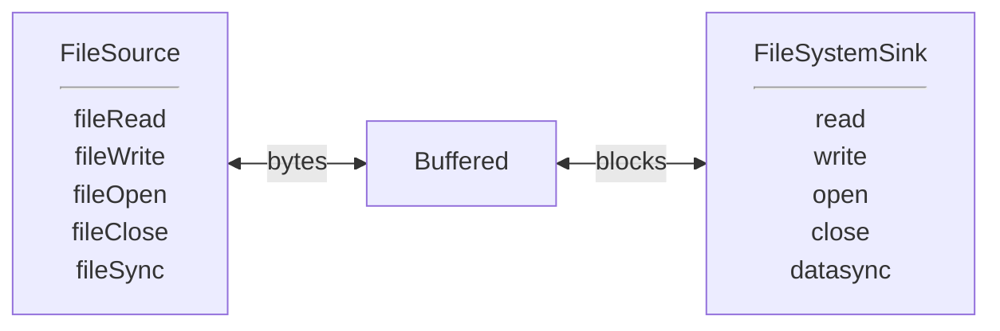
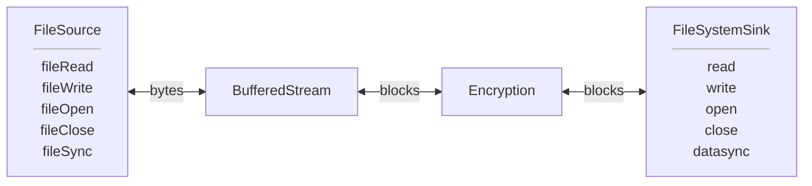
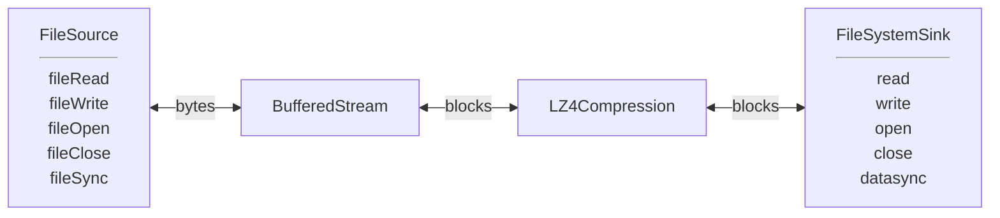
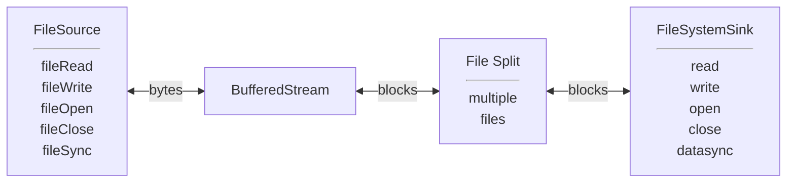
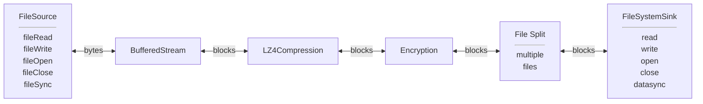

# File I/O with Encryption/Compression

## Goals:
### Current:
- Uniform fread/fwrite/fseek interface for all non-paged files.
- Incorporate existing features of BufFiles, transient files and Virtual FDs.
- encryption and authentication using aes-gcm or chacha-poly.
- compression using lz4.
- Efficient streaming.
- Random I/O to regular and encrypted files.

### Later:
- Appending to compressed files.
- Random reads from compressed files.
- Additional compression/encryption algorithms

### Possible, but not in plan.
- Public signature authentication.
- O_DIRECT and asynchronous I/O
- File output compatible with existing compression and encryption utilities.

### Not:
 - Random writes to compressed files.

## Record Oriented I/O
### Logical Model
- A file consists of a sequence of fixed-size record, followed by
  a final record which may be smaller.
- A record fits into memory.
- A record is a known point for positioning.
- To append to a file, the last record may be overwritten.
- Various filters may change the record size or add headers. These transformations 
  are not visible to the users of the data.
- Can determine file size by seeking to the end.
   Might not be the exact file size, but must be good enough to determine number
  of fixed size records and whether there is a partial record at the end.
  
***Note: cannot currently seek in compressed files.***

### Encryption
- An encrypted file may include a fixed size header describing blocksize, initialization vector
  and other parameters. ***NOTE: For now, skip the header.***
- Each block includes a MAC tag to confirm the block has not been modified.
- A block may or may not include padding. ***NOTE: for now, each block is padded.***
- The last block will always be smaller than a full block. This confirms
  the file is complete and not truncated. If necessary, an extra "empty" block
  will be appended.
- The fixed header includes an empty ciphertext record,
  allowing the header to be validated as "Additional Data" before being used.
  ***NOTE: for now, no header to validate.***
### Compression
- Output blocks have variable size, so actual block size is prepended 
  to each block.
- Can read/write sequentially, rewind, and append after reading to end.
- Cannot seek.
- Possible to create a block index, allowing appends and read seeks.

## Stream Oriented I/O
- A "ByteStream" reads and writes bytes, ignoring the underlying
  structure of blocks.
- A byte stream is equivalent to a block file with block size of 1 byte.
- "Buffered" converts a byte stream to fixed size blocks.

## Filters
 - Filters convert a block of data from one form to another.
 - Need to know if size change is fixed or variable.

### Initialization
1. pipeline creation
1. open file
  1. Initiate with fileOpen() at front of pipeline.
  1. read/create file headers
  1. negotiate record sizes
  2. query file size
1. Negotiate Record size
1. ready to exchange records

## Use Cases
### fread/fwrite/fseek replacement

### Encryption

### Compression

### Split a stream into multiple files.

### Why not? All of the above.

TODO:
- Seek tests on encrypted files.
- compression on streamed files.
- Read seeks on compressed files with record index.
- Update vocabulary (records, not blocks)
- bring code in line with Postgres standards
- non-static error messages
- enforce readable/writeable in read/write.
- test O_APPEND
- BufFile integration (or equivalent);
- Multiple Opens? (Needed for random seeks in distributed files)
- End of File : verify encrypted file actually ends.

### Proposed Vocabulary (Not reflected in code yet)
***Block*** - A cipher block, 16 bytes for AES.
 ***Record*** - A piece of data which fits in memory.
 ***File*** - A collection of fixed size records, where the last record might be smaller.
 Note it is possible to seek to any record in a file.
 ***Sized Record*** - A record preceded by its size.
 ***File of Sized Records*** - A file consisting of variable sized records. 
 Note it is possible to create an index, making it possible to seek to a sized record.
 ***Header*** - A record at the beginning of a file describing how to interpret the file. 
 Note the header may be of different size than other records in a file.
