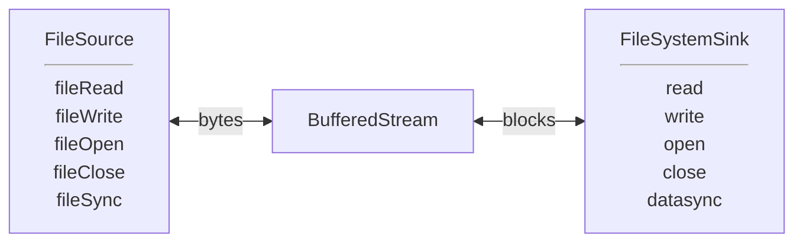
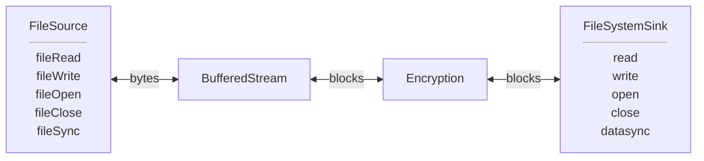
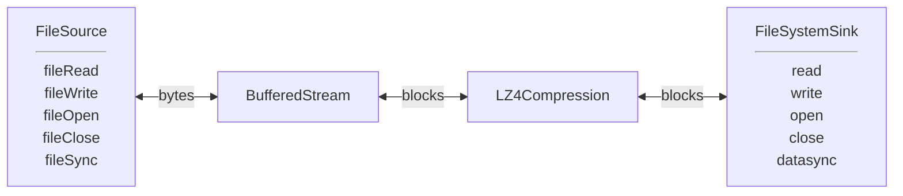
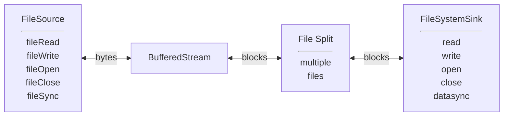
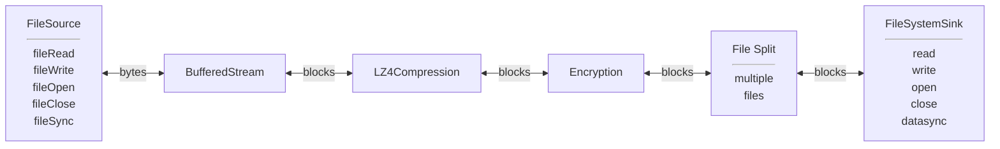

## Use Cases
### fread/fwrite replacement

### Encryption

### Compression

### Split a stream into multiple files.

### Why not? All of the above.

TODO:
- checksum/digest
- bring code in line with Postgres standards
- non-static error messages
- enforce readable/writeable in read/write
- O_DIRECT and async I/O?
- add isReadable, isWriteable, isOpen to header, so passThroughXXX can do some simple error handling (instead of each filter)
  Stream API
