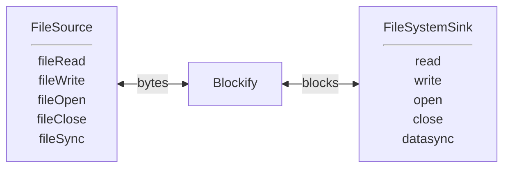
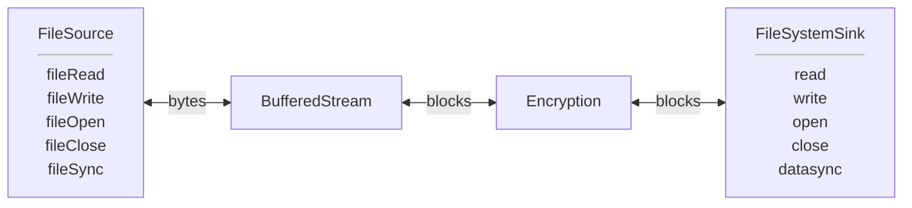
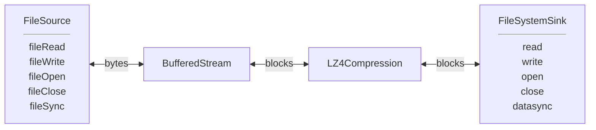
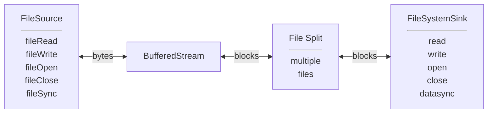
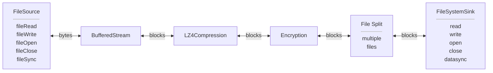

# File I/O with Encryption/Compression

## Goals:
### Current goals:
- Uniform fread/fwrite/fseek interface for all non-paged files.
- Incorporate existing features of Bufiles, transient files and Virtual FDs.
- encryption and authentication using aes-gcm or chacha-poly.
- compression using lz4.
- Efficient streaming.
- Random I/O to regular and encrypted files.

### Later goals:
- Appending to compressed files.
- Random reads from compressed files.
- Support O_DIRECT
- Additional compression/encryption algorithms
- Public signature authentication.

### Not goals:
 - Random writes to compressed files.
 - Asynchronous I/O

## Block Oriented I/O
### Logical Model
- A block file consists of a sequence of fixed-size blocks, followed by
  a final block which may be smaller.
- A block fits into memory.
- A block is a known point for positioning, with blocks being numbered 0 through n-1.
- To append to a block file, the last block may be overwritten.
- Various filters may change the blocksize or add headers. These transformations 
  are not visible to the users of the data.
- Can query # of blocks in a block file, but may need to read last block to determine file size.

### Encryption
- An encrypted file includes a fixed size header describing blocksize, initialization vector
  and other parameters. ***NOTE: For now, skip the header.***
- Each block includes a MAC tag to confirm the block has not been modified.
- A block may or may not include padding. ***NOTE: for now, each block is padded.***
- The last block will always be smaller than a full block. This confirms
  the file is complete and not truncated. If necessary, an extra "empty" block
  will be appended.
- The fixed header includes an empty ciphertext record,
  allowing the header to be validated as "Additional Data" before being used.
  ***NOTE: for now, no header to validate.***
### Compression
- Output blocks have variable size, so each block is prepended with its size.
- Can read/write sequentially, rewind, and append after reading to end.
- Cannot seek.
- Possible to create a block index, allowing appends and read seeks.

## Stream Oriented I/O
- A "ByteStream" reads and writes bytes, ignoring the underlying
  structure of blocks.
- Stream files can only be written to at the end of the file.
- Stream files do not seek and data cannot be rewritten.

## Filters
 - Filters convert a block of data from one form to another.
 - Need to know if size change is fixed or variable.

For now, filter records must have fixed size. For example,
encrypting a fixed-size block of data must generate a known, fixed-size 
frame. The sizes need not match, but they must be predictable.

## Stages
While filters transform data, they generally do not 
change the structure of the files containing the data. In particular, they do not even 
know if the data stream is being read or written. Those decisions are made by the
"stages" in the I/O pipeline.

## Use Cases
### fread/fwrite/fseek replacement

### Encryption

### Compression

### Split a stream into multiple files.

### Why not? All of the above.

TODO:
- checksum/digest
- bring code in line with Postgres standards
- non-static error messages
- enforce readable/writeable in read/write
- O_DIRECT and async I/O?
- add isReadable, isWriteable, isOpen to header, so passThroughXXX can do some simple error handling (instead of each filter)
  Stream API
