## Use Cases


### fread/fwrite Replacement

### With Encryption


### With Compression

```mermaid

flowchart LR
    start[fileRead <br> fileWrite <br> fileOpen <br> fileClose <br> fileSync]
      <--> FileSource <-- bytes --> BufferedStream <-- blocks --> FilesystemSink <-->
    stop[read <br> write <br> open <br> close <br> datasync]
    
    classDef Invisible fill:#000000,stroke:#000000;
    %%class start,stop Invisible;%%
```


### Split a stream into multiple files.
```mermaid

flowchart LR
    start[fileRead <br> fileWrite <br> fileOpen <br> fileClose <br> fileSync]
      <--> FileSource <-- bytes --> BufferedStream <-- blocks --> FilesystemSink <-->
    stop[read <br> write <br> open <br> close <br> datasync]
    
    classDef Invisible fill:#000000,stroke:#000000;
    %%class start,stop Invisible;%% 
 ```


TODO:
- checksum/digest
- bring code in line with Postgres standards
- non-static error messages
- enforce readable/writeable in read/write
- O_DIRECT and async I/O?
- add isReadable, isWriteable, isOpen to header, so passThroughXXX can do some simple error handling (instead of each filter)
